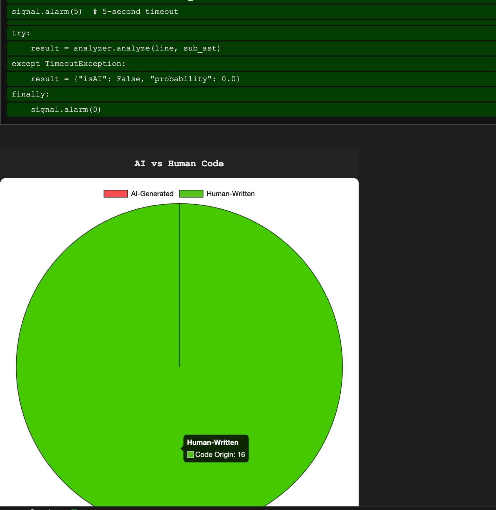
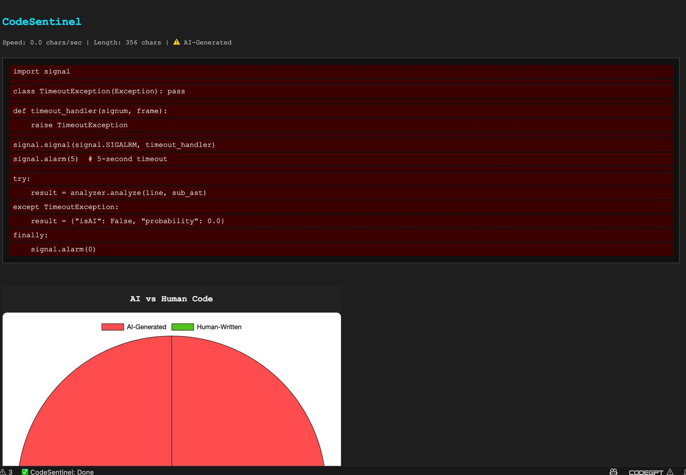
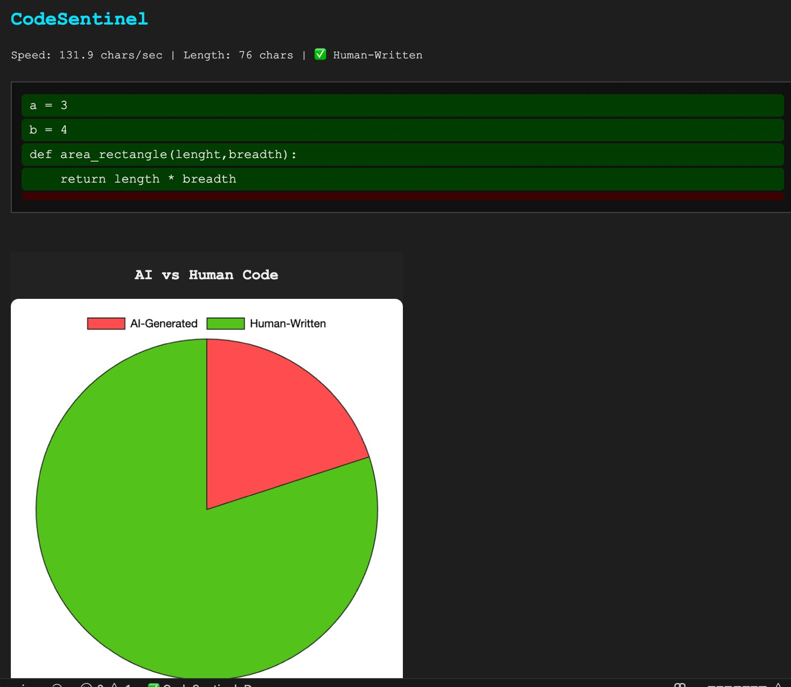

# CodeSentinel: Semantic-Temporal AI Code Auditor 

 ISE TOOL PROJECT
 
> **Detect AI-generated code in real time** within VSCode using semantic analysis (CodeBERT + AST) and temporal signals (typing speed, edit events).

---

## 🖥️ Supported Platforms

* **macOS** 10.15+
* **Ubuntu** 18.04+

> 🚫 Not tested or supported on Windows.

---

## 📦 Prerequisites

1. **VSCode** (v1.60+)
2. **Node.js** (v14 LTS or higher)
3. **npm** (v6+)
4. **Python** (v3.8+)
5. **pip** (v20+)

Optional (for NLP model acceleration):

* **GPU & CUDA** (if using `torch` with GPU support)

---

## ⚙️ Installation

### 1. Clone the repository

```bash
git clone https://github.com/YourOrg/CodeSentinel.git
cd CodeSentinel
```

### 2. Backend Setup (FastAPI + CodeBERT)

```bash
cd backend
# Create Python venv
python3 -m venv .venv
source .venv/bin/activate            # macOS / Ubuntu
pip install --upgrade pip
# Install dependencies
pip install -r requirements.txt      # (fastapi, uvicorn, transformers, torch, tree-sitter, shap, sqlite3)
```

### 3. Frontend/Extension Setup (VSCode)

```bash
cd ../VScodeextension
# installs vscode, axios, etc.
# npm install required dependecies
# open extension.js
run F5
for windows: ctrl+shift+p
for mac: cmd+shift+p
activate: codesentinal:show panel
```

> **Note:** If packaging as a `.vsix`, you can use `npm install -g vsce` then `vsce package`.

---

## 🚀 Quick Start

1. **Start the backend** (serves semantic scores):

   ```bash
   cd backend
   source .venv/bin/activate
   uvicorn main:app --reload --host 127.0.0.1 --port 8000
   ```

2. **Launch the VSCode extension**:

   * Open the `extension/` folder in VSCode.
   * Press `F5` to launch a new Extension Development Host.
   * In the new window, open any Python file.
   * The extension auto-triggers on edits; or run command **`CodeSentinel: Show Panel`**.

3. **View results** in the **CodeSentinel** panel:

   * Per-line coloring (red = AI, green = human)
   * Typing speed & length stats bar
   * AI vs. human pie chart

---

## 📋 Usage & Configuration

* **Language Support**: Currently only `python`. Add other `languageId` in `extension.js` under `supportedLanguages`.
* **Thresholds**:

  * Adjust **typing speed threshold** (`10 chars/sec`) in `panel.html`.
  * Adjust **AI probability threshold** (`0.5`) in `panel.html`.
* **Database**:

  * Logs saved in `activity.db` (SQLite) next to the extension context.
  * Schema auto-created on activation.

---

## 🔗 Dependencies

### Backend (`backend/requirements.txt`)

```
fastapi
uvicorn
transformers
torch
tree-sitter
shap
sqlite3
```

### Extension (`extension/package.json`)

```json
{
  "dependencies": {
    "axios": "^0.21.1",
    "vscode": "^1.1.37"
  }
}
```

---

## Ressults







---

## 🧑‍🤝‍🧑 Team & Credits

* **Silpa Roy (CS25D002)** — Temporal tracking & typing-speed calculation, SQLite logging, heuristics and handled package.json, and build scripts.
* **Kavyasri (CS24M111)** — AST parsing, CodeBERT integration, SHAP explainability, backend APIs.
* **Logesh (CS24M106)** — VSCode panel UI (HTML/CSS/Chart.js), extension wiring, packaging, documentation.
